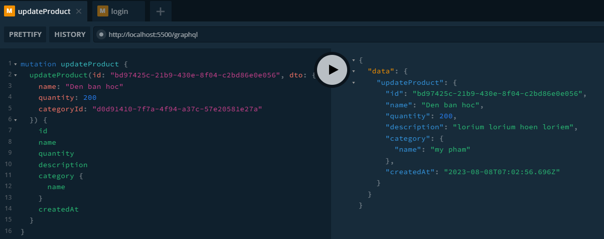

<h1 align="center">PRODUCT MANAGEMENT</h1>

## Description

- This is a sample project for CRUD product and category.
- Main features:
  - Sign in, sign up
  - CRUD Product, category
  - Change password
- Technologies: NestJS, GrapQL, TypeORM, MySQL

## EER Diagram

<a href="https://res.cloudinary.com/tinner/image/upload/v1691469539/eer_diagram_pxm9d9.png" target="blank"></a>

## Screenshot

<h4>1. Sign in</h4>

<a href="#" target="blank"></a>

<h4>2. Sign up</h4>
<a href="#" target="blank"></a>

<h4>3. Change password</h4>

<a href="#" target="blank"></a>

<h4>4. Get product pagination</h4>

<a href="#" target="blank"></a>

<h4>5. Get product by id</h4>

<a href="#" target="blank"></a>

<h4>6. Create product</h4>

<a href="#" target="blank"></a>

<h4>8. Update product</h4>

<a href="#" target="blank"></a>

<h4>9. Delete product</h4>

<a href="#" target="blank"></a>

<h4>10. Get category by Id</h4>

<a href="#" target="blank"></a>

<h4>11. Get all categories</h4>

<a href="#" target="blank"></a>

<h4>12. Get categories pagination</h4>

<a href="#" target="blank"></a>

<h4>13. Update category</h4>

<a href="#" target="blank"></a>

<h4>14. Detele category</h4>

<a href="#" target="blank"></a>

## Installation

```bash
$ yarn install
```

## Running the app

```bash
# development
$ yarn run start

# watch mode
$ yarn run start:dev

# production mode
$ yarn run start:prod
```

## License

Nest is [MIT licensed](LICENSE).
